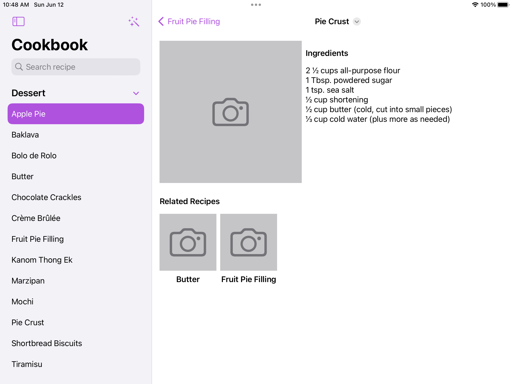
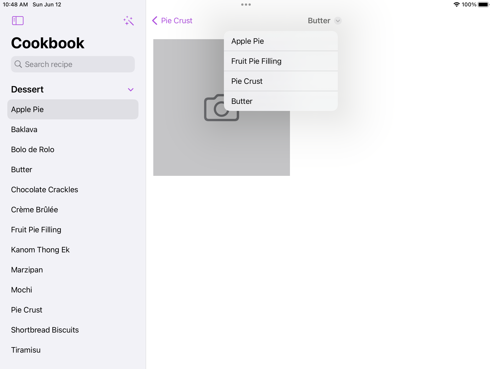

# Challenge: SwiftUI navigation hotdish

See this challenge definition at: [Challenge: SwiftUI navigation hotdish](https://developer.apple.com/news/?id=4a3k7k30)

## Proposed solution

The new SwiftUI version is introducing programmatic navigation. To try with a real life example and try as most features as possible, I used the following:

- `SplitNavigationView`: to display a sidebar with grouped recipes by category, which can be collapsed. Also a search bar as it is the natural way to search for recipes (in a real cookbook we would use the table of contents).

- `StackNavigationView`: to display related recipes of a root one in the same place, without losing the selected recipe state. As when we are taking a look at related content, we usually want to return to the original one.

- `navigationTitle` actions: we are now able to show a dropdown list of buttons next to a `navigationTitle`. This list is used as a breadcrumb to navigate between the stack of related recipes visited, and to quickly return to the root recipe.

## Bringing robust navigation structure to your SwiftUI app.
Use navigation links, stacks, destinations, and paths to provide a streamlined experience for all platforms, as well as behaviors such as deep linking and state restoration.

## Overview

- Note: This sample code project is associated with WWDC22 session [10054: The SwiftUI cookbook for navigation](https://developer.apple.com/wwdc22/10054/).
